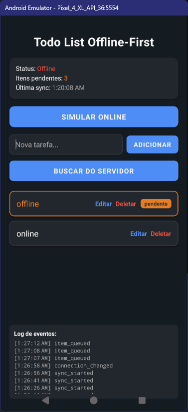

# Sync Engine Monorepo

Este repositório contém uma solução completa para sincronização bidirecional offline-first em React Native/Expo, incluindo:

- **`packages/sync-engine-lib`**: Biblioteca TypeScript para sincronização offline/online com SQLite e autosync.
- **`apps/demo-app`**: App Expo demonstrando o uso da lib em um Todo List offline-first.
- **`apps/demo-server`**: Servidor Express para simular backend e testar o fluxo de sync.

---

## 🚀 Visão Geral

- Sincronização bidirecional: app <-> servidor
- Funciona 100% offline: todas as operações são salvas localmente e sincronizadas quando a conexão volta
- Resolução de conflitos, retry automático, fila persistente (SQLite)
- Pronto para React Native/Expo SDK 53+

---

## 📦 Sync Engine Lib

Biblioteca TypeScript para sincronização bidirecional offline-first.

### Instalação

```bash
yarn add sync-engine-lib
# ou
npm install sync-engine-lib
```

**Peer dependencies:**

```bash
yarn add expo-sqlite @react-native-community/netinfo
```

### Uso Básico

```typescript
import { SyncEngineFactory } from "sync-engine-lib";

const syncEngine = SyncEngineFactory.createForDevelopment(
  "http://localhost:4000"
);
await syncEngine.initialize();
await syncEngine.start();

// Adiciona item à fila (offline ou online)
await syncEngine.addToQueue(SyncEngineUtils.generateId(), "todo", {
  text: "Minha tarefa",
  done: false,
  createdAt: Date.now(),
  updatedAt: Date.now(),
});
```

### Fluxo Offline-First

- **Online:** O app sincroniza automaticamente com o servidor.
- **Offline:** Todas as operações são salvas localmente (SQLite). Nenhuma requisição é feita ao servidor.
- **Quando volta a ficar online:** A SyncEngine envia tudo que estava pendente para o servidor.

Você pode forçar o modo offline/online para testes:

```typescript
syncEngine.setForcedOnline(false); // Força modo offline
syncEngine.setForcedOnline(true); // Força modo online
syncEngine.setForcedOnline(null); // Volta ao modo automático
```

---

## 📱 Demo App (Expo)

App de Todo List demonstrando o uso da Sync Engine.



### Rodando o app

```bash
cd apps/demo-app
yarn install
npx expo start
```

- O app funciona 100% offline-first.
- Use o botão "Simular Offline" para testar o fluxo offline.
- Crie, edite e delete tarefas mesmo sem internet. Ao voltar para online, tudo será sincronizado.

---

## 🖥️ Demo Server

Servidor Express simples para simular backend e testar a sincronização.

### Rodando o servidor

```bash
cd apps/demo-server
yarn install
yarn start
```

- O servidor expõe `/sync` (POST) e `/todos` (GET)
- Suporta soft delete, merge simples e atualização de tarefas

---

## 🔄 Exemplo de Fluxo Completo

1. Inicie o servidor: `cd apps/demo-server && yarn start`
2. Inicie o app: `cd apps/demo-app && npx expo start`
3. No app, adicione/edite/delete tarefas offline
4. Volte para online: a SyncEngine sincroniza tudo automaticamente
5. Veja o log de eventos no app e os dados atualizados no servidor

---

## 🛠️ Comandos Úteis

- **Build da lib:**
  ```bash
  cd packages/sync-engine-lib
  yarn build
  ```
- **Limpar cache do Expo:**
  ```bash
  npx expo start -c
  ```
- **Reinstalar dependências:**
  ```bash
  yarn install
  ```

---

## 🤝 Contribuindo

1. Fork o projeto
2. Crie uma branch: `git checkout -b feature/nova-feature`
3. Commit: `git commit -m 'feat: nova feature'`
4. Push: `git push origin feature/nova-feature`
5. Abra um Pull Request

---

## 📄 Licença

MIT

---

Desenvolvido para React Native/Expo SDK 53+ com TypeScript, SQLite e NetInfo.
