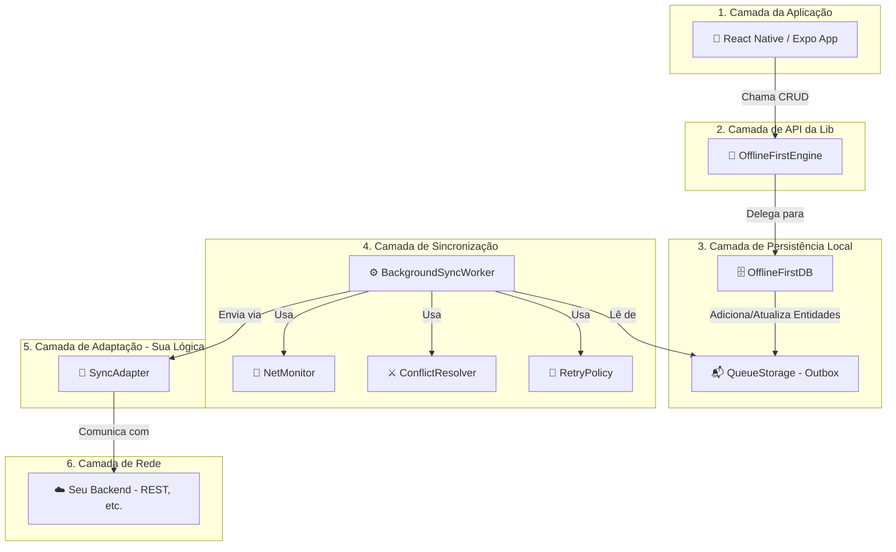

## Arquitetura Offline-First

A arquitetura da **Sync Engine Lib** foi projetada para ser modular, desacoplada e extensível, permitindo que você tenha controle total sobre a camada de rede enquanto a biblioteca gerencia toda a complexidade do armazenamento local e da lógica de sincronização.

## Visão Geral da Arquitetura

O diagrama abaixo ilustra as principais camadas e componentes da biblioteca e como eles interagem entre si, desde a UI do seu aplicativo até o seu backend.

## Componentes Principais

1. **Camada da Aplicação (Seu App)**

   - É a interface do usuário do seu aplicativo React Native/Expo.
   - Interage com a biblioteca através da `OfflineFirstEngine`, chamando métodos simples de CRUD como `create`, `findAll`, `update`, `delete`.

2. **Camada de API da Lib (`OfflineFirstEngine`)**

   - Este é o principal ponto de entrada para a maioria dos usuários da biblioteca.
   - A `OfflineFirstEngine` orquestra todos os componentes internos, fornecendo uma API de alto nível e fácil de usar (`engine.table('todos').create(...)`).

3. **Camada de Persistência Local (SQLite)**

   - **`OfflineFirstDB`**: Gerencia as tabelas das suas entidades de dados (ex: `todos`, `posts`). Todas as operações de escrita são feitas aqui primeiro, garantindo uma resposta instantânea para a UI.
   - **`QueueStorage`**: Implementa o padrão **Outbox**. Cada operação de escrita (C, U, D) é registrada como um item em uma fila de "saída". Esta fila é a fonte da verdade para o que precisa ser sincronizado com o servidor.

4. **Camada de Sincronização**

   - **`BackgroundSyncWorker`**: O coração da sincronização. Este worker roda em segundo plano, pega itens da `QueueStorage`, e os processa em lotes.
   - **`NetMonitor`**: Verifica o status da conexão de rede e informa o `Worker` quando é seguro tentar a sincronização.
   - **`ConflictResolver`**: Se o `Worker` detecta um conflito (ex: o dado no servidor é mais novo), esta classe é usada para resolver a disputa com base em uma estratégia definida por você (`client-wins`, `server-wins`, etc.).
   - **`RetryPolicy`**: Se uma operação de rede falha, esta classe determina se e quando a operação deve ser tentada novamente, geralmente com uma estratégia de _exponential backoff_.

5. **Camada de Adaptação (`SyncAdapter`)**

   - **Esta é a única parte que você precisa implementar.** O `SyncAdapter` é uma classe abstrata que define um contrato de como a `Sync Engine` se comunica com o mundo exterior.
   - Você cria uma classe que estende `SyncAdapter` e implementa os métodos `create`, `update`, `delete`, e `fetchUpdates` com a lógica específica para chamar **seu backend**.
   - A biblioteca já fornece um `RestAdapter` para facilitar a integração com APIs REST.

6. **Camada de Rede (Seu Backend)**
   - O seu servidor. A `Sync Engine` é completamente agnóstica em relação ao seu backend. Pode ser REST, GraphQL, Firebase, Supabase, ou qualquer outra coisa, desde que você forneça um `SyncAdapter` para ele.

## Fluxo de uma Operação (Ex: Criar Tarefa)

1. **UI**: O usuário digita "Comprar pão" e clica em "Adicionar".
2. **Engine**: Seu código chama `await engine.table('todos').create({ text: 'Comprar pão' })`.
3. **OfflineFirstDB**:
   - Um novo "todo" é inserido **imediatamente** na tabela `todos` do SQLite com status `pending`.
   - A UI é notificada e a nova tarefa aparece na tela instantaneamente.
4. **QueueStorage**:
   - Uma nova operação `{ operation: 'CREATE', entity: 'todos', ... }` é adicionada à tabela `outbox`.
5. **BackgroundSyncWorker**:
   - Em seu próximo ciclo (ou imediatamente, se configurado), o worker vê a nova operação na fila.
   - Ele verifica com o `NetMonitor` se há conexão.
   - Se online, ele chama `adapter.create({ text: 'Comprar pão' })`.
6. **SyncAdapter**:
   - Sua implementação do adapter faz uma chamada `POST /api/todos` para o seu backend.
7. **Backend**:
   - Seu servidor processa a requisição, salva o dado no banco de dados principal e retorna o registro completo (com um `id` do servidor).
8. **Retorno do Fluxo**:
   - O `Worker` recebe a resposta de sucesso do `Adapter`.
   - Ele atualiza o status da operação na `outbox` para `synced`.
   - Ele atualiza o status do item na tabela `todos` para `synced` e armazena o `_server_id`.
   - A UI é notificada novamente, e o indicador de status da tarefa pode mudar de "Pendente" para "Sincronizado".

Este design garante que o aplicativo seja sempre rápido e funcional para o usuário, enquanto a complexidade da sincronização de rede é tratada de forma robusta e resiliente em segundo plano.
