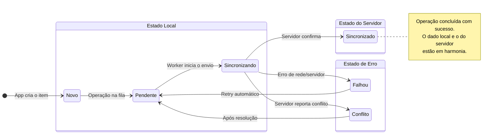

# O Ciclo de Vida de um Dado

Cada registro (ou entidade) que você gerencia com a `sync-engine-lib` passa por um ciclo de vida bem definido, representado pelo seu campo de metadados `_status`. Entender esses estados é fundamental para construir uma UI informativa e para depurar o comportamento da sincronização.

O diagrama abaixo ilustra a transição entre os diferentes estados:

## Detalhes dos Estados (`_status`)

1.  **`new`** (Novo)
    - **O que significa:** Este é o estado inicial de um registro que foi buscado do servidor e ainda não sofreu nenhuma modificação local.
    - **Quando ocorre:** Geralmente, você verá este estado para dados que são populados no banco de dados local a partir de uma chamada `fetchUpdates` do seu `SyncAdapter`.

2.  **`pending`** (Pendente)
    - **O que significa:** O registro foi criado, atualizado ou deletado localmente, e a operação está na fila (`outbox`) aguardando para ser enviada ao servidor.
    - **Quando ocorre:** Imediatamente após você chamar `create()`, `update()` ou `delete()`.
    - **Na UI:** Este é o momento ideal para mostrar um ícone de "relógio" ou "nuvem enviando", indicando ao usuário que a alteração foi salva localmente e será sincronizada em breve.

3.  **`syncing`** (Sincronizando)
    - **O que significa:** O `BackgroundSyncWorker` pegou a operação da fila e está ativamente tentando enviá-la para o servidor.
    - **Quando ocorre:** Durante a chamada de rede do `SyncAdapter`.
    - **Na UI:** Você pode manter o mesmo indicador de "pendente" ou usar um spinner mais ativo para mostrar que a comunicação está em andamento.

4.  **`synced`** (Sincronizado)
    - **O que significa:** A operação foi confirmada pelo servidor com sucesso. O dado local está em sincronia com o servidor.
    - **Quando ocorre:** Após o `SyncAdapter` retornar uma resposta de sucesso do backend.
    - **Na UI:** O indicador de status pode ser removido ou substituído por um checkmark verde (✓), confirmando ao usuário que sua alteração está salva e segura no servidor.

5.  **`failed`** (Falhou)
    - **O que significa:** A tentativa de sincronização falhou devido a um erro (ex: erro de rede, erro 500 do servidor).
    - **Quando ocorre:** Quando o `SyncAdapter` lança uma exceção ou retorna um resultado de erro que é marcado como "retryable" (tentável novamente).
    - **Comportamento:** A operação permanecerá na fila e será tentada novamente mais tarde, de acordo com a `RetryPolicy`. O campo `retry_count` é incrementado.
    - **Na UI:** É crucial mostrar um indicador de erro (ex: um "X" vermelho) para que o usuário saiba que algo deu errado, mas que o sistema tentará novamente.

6.  **`conflict`** (Conflito)
    - **O que significa:** O servidor indicou que a operação não pôde ser concluída porque o estado do dado no servidor mudou desde a última vez que o cliente o viu. (Ex: outro usuário editou o mesmo registro).
    - **Quando ocorre:** Quando o `SyncAdapter` detecta uma resposta de conflito do servidor (ex: HTTP 409 Conflict).
    - **Comportamento:** A `ConflictResolver` é acionada para resolver a disputa. Dependendo da estratégia, a operação pode ser reenviada, descartada ou exigir intervenção manual.
    - **Na UI:** Um indicador de conflito (ex: um "!") alerta o usuário. Em casos de resolução manual, a UI deve apresentar opções para o usuário decidir qual versão do dado manter.
