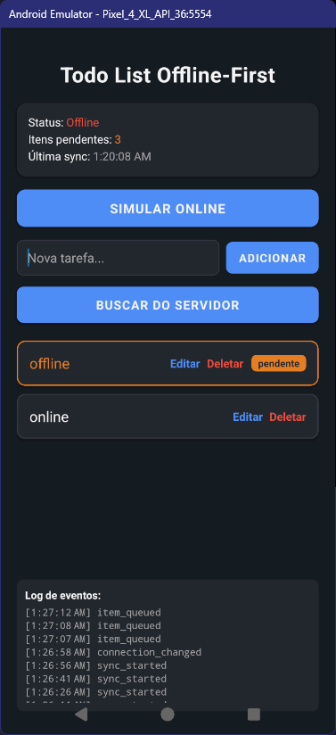

# Sync Engine Overview

Sync Engine é uma biblioteca para sincronização bidirecional offline-first em React Native/Expo, usando SQLite local e autosync com o backend.

> Sincronize dados entre app e servidor, mesmo sem internet. Autosync, fila persistente, resolução de conflitos e muito mais!

---

## Principais Diferenciais

<div style={{display: 'flex', gap: '1.5rem', flexWrap: 'wrap', marginBottom: '2rem'}}>
  <div style={{flex: 1, minWidth: 220, background: 'var(--ifm-card-background-color)', borderRadius: 12, padding: 20, boxShadow: '0 2px 8px #0002'}}>
    <b>Offline-First</b>
    <p style={{margin: 0}}>Funciona 100% offline: todas as operações são salvas localmente e sincronizadas quando a conexão volta.</p>
  </div>
  <div style={{flex: 1, minWidth: 220, background: 'var(--ifm-card-background-color)', borderRadius: 12, padding: 20, boxShadow: '0 2px 8px #0002'}}>
    <b>Autosync & Retry</b>
    <p style={{margin: 0}}>Sincronização automática, retry inteligente, fila persistente em SQLite e status global.</p>
  </div>
  <div style={{flex: 1, minWidth: 220, background: 'var(--ifm-card-background-color)', borderRadius: 12, padding: 20, boxShadow: '0 2px 8px #0002'}}>
    <b>Plug-and-Play</b>
    <p style={{margin: 0}}>Fácil de integrar em qualquer app React Native/Expo. Totalmente tipado em TypeScript.</p>
  </div>
</div>

---

## Exemplo de Uso Rápido

```typescript
import { SyncEngineFactory, SyncEngineUtils } from "sync-engine-lib";

const syncEngine = SyncEngineFactory.createForDevelopment(
  "http://localhost:4000"
);
await syncEngine.initialize();
await syncEngine.start();

await syncEngine.addToQueue(SyncEngineUtils.generateId(), "todo", {
  text: "Minha tarefa",
  done: false,
  createdAt: Date.now(),
  updatedAt: Date.now(),
});
```

---

## Veja funcionando na prática



---

## Navegação

- [Instalação](./intro)
- [Como funciona](./how-it-works)
- [API e exemplos](./api)
- [FAQ](./faq)
