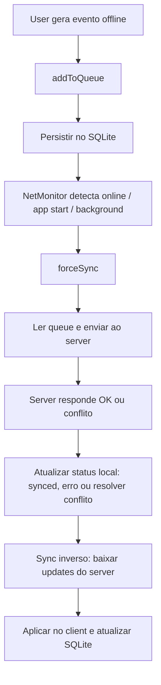

# 📦 Sync Engine Lib – Arquitetura & Plano

## ✨ Ideia Geral

Criar uma **biblioteca em TypeScript** para React Native (Expo SDK 53) que ofereça sincronização **bidirecional** entre cliente e servidor, focada em apps **offline-first**.  
O objetivo é permitir que múltiplos apps React Native/Expo reutilizem essa lib de forma plug-and-play, garantindo:

- Autoqueue de eventos offline
- Autosync ao conectar ou abrir app
- Retry com backoff
- Resolução de conflitos (pluggable)
- Experiência de dev amigável + documentação clara

A lib deve ser **compatível com Expo SDK 53** (managed workflow, sem ejetar) e usar `expo-sqlite` para persistência local.

---

## ✅ Requisitos

- Compatível com Expo SDK 53 e `expo-sqlite`
- Sincronização bidirecional (client ↔ server)
- Offline-first: gravar dados gerados offline localmente
- Autoqueue: interceptar eventos e salvar no queue
- Autosync:
  - Ao conectar na internet
  - Ao abrir o app
  - Ao voltar do background
- Retry automático com backoff exponencial
- Resolução de conflitos (pluggable)
- Observabilidade: status global de sync
- Hooks/eventos customizáveis (`onBeforeSync`, `onSuccess`, `onError`)
- Estrutura modular e clara para reuso
- Documentação de como integrar, extender e debugar
- API intuitiva e DX pensada

---

## 🧩 Estrutura sugerida

```text
/sync
├── syncEngine.ts       # Núcleo: addToQueue, forceSync, getStatus etc.
├── queueStorage.ts     # CRUD SQLite (expo-sqlite)
├── netMonitor.ts       # Monitorar conectividade com @react-native-community/netinfo
├── retryPolicy.ts      # Lógica de backoff e retries
├── conflictResolver.ts # Estratégias pluggable de conflito
├── types.ts            # Tipagens globais
└── index.ts            # Export principal
```

---

## 🧠 Funcionalidades core

- Queue persistente em SQLite com status (`pending`, `synced`, `error`)
- Campo `retryCount`, `lastTriedAt`, `createdAt` para controle
- Sync em batch (reduz consumo)
- Configuração custom: intervalos, endpoints, batch size
- Transformações beforeSync / afterSync
- Atualização incremental: sync apenas o que mudou desde último sync
- Hooks: `onQueueChange`, `onSyncStart`, `onSyncComplete`, etc.
- Suporte a múltiplos tipos de item (ex.: check-ins, fotos, pedidos)

---

## 🔄 Fluxo geral



---

## 🛠️ Plano de ação

1. Definir `QueueItem` genérico:

   ```ts
   type QueueItem = {
     id: string;
     type: string;
     payload: any;
     status: "pending" | "synced" | "error";
     retries: number;
     lastTriedAt?: number;
     createdAt: number;
   };
   ```

2. Implementar camada SQLite isolada (`queueStorage.ts`)
3. Criar `syncEngine` com:

   - `addToQueue`
   - `forceSync`
   - `getStatus`
   - `startAutoSync`

4. Adicionar `netMonitor` para disparar sync on-connect / on-start
5. Escrever `retryPolicy` com backoff
6. Definir interface para `conflictResolver` (ex.: merge ou override)
7. Escrever documentação clara:

   - Como instalar & configurar
   - Exemplos de uso
   - Como plugar estratégia de conflito
   - Boas práticas para consumo em produção

8. Pensar em métricas internas (quantos itens pendentes, tempo médio de sync)

---

## 🪛 Detalhes importantes

- **Expo SDK 53** e `expo-sqlite` (managed workflow)
- Modular, fácil de extender e reutilizar
- Compatível com múltiplos apps React Native Expo
- Foco em DX: APIs simples, nomes autoexplicativos
- Documentação e exemplos prontos no README
- Hooks/eventos para permitir feedback visual no app
- Garantir atomicidade com transações no SQLite

---

## ⚡ Stack

- TypeScript
- expo-sqlite
- @react-native-community/netinfo

---

## 📚 Documentação (essencial para DX)

- Overview (como funciona)
- Instalação e setup
- Como interceptar eventos e salvar no queue
- Como customizar retry e conflito
- API Reference: métodos, tipos, exemplos
- Casos de uso: multi-tenant, sync em background etc.

---

> 🧩 **Resumo:** Lib moderna em TypeScript, offline-first, bidirecional, plugável e amigável para Expo SDK 53 – focada em performance, estabilidade e ótima dev experience.

```

```
